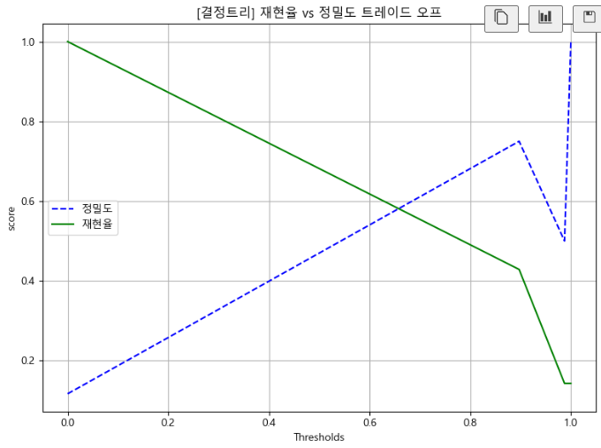
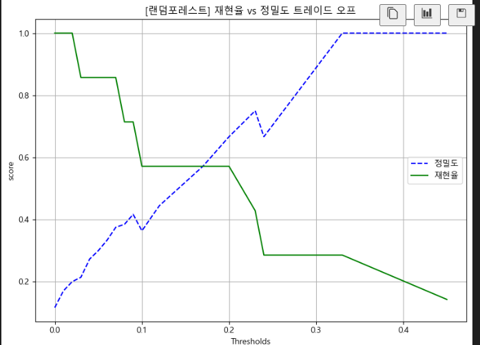
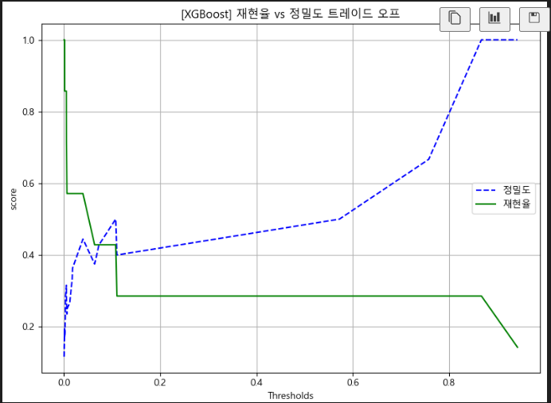

# Day 30 (2025-08-03)
## 개요
- 분류 모델 비교 (로지스틱 회귀, 결정트리, 랜덤포레스트, XGBoost)
## 목표
- 기말고사를 보기 전, 중간고사 점수, 과제점수, 생활 습관(수면시간, 하루공부시간, SNS사용 시간)으로 최종 학점(A 등급 여부) 예측 모델 제작하고 성능비교

## 발생한 문제점
- 완성된 모델을 테스트 셋을 활용해 테스트 하는 과정에서 정밀도, 재현율이 모두 0이 나오는 문제 발생 \
-> 
💡 테스트 셋을 0/1로 나누는 과정에서 1이 너무 적었음. \
따라서, 1에 가중치를 두는 `class_weight='balanced'`명령어 사용. \
XGBoost는 `scales_pos_weight` 명령어 사용

## 최종 모델 비교표
**1. 단일 테스트셋**

| 모델명            | 정확도 | 정밀도 | 재현율 | F1-score | AUC  |
|------------------|--------|--------|--------|----------|------|
| 로지스틱 회귀     |    0.85    |   0.41     |  0.71      |  0.52        | 0.91     |
| 결정 트리         |   0.92     |  0.75      |  0.42      |  0.54        |  0.70    |
| 랜덤 포레스트     |     0.88   |    0.0    |  0.0      |    0      |  0.88    |
| XGBoost          |     0.88   |  0.5      |  0.28      |   0.36       |  0.83    |

**2. K-Fold 교차검증 (k=5)**

| 모델명            | 평균 정확도 | 평균 정밀도 | 평균 재현율 | 평균 F1-score |
|------------------|-------------|--------------|--------------|----------------|
| 로지스틱 회귀     |     0.86    |      0.32  |   0.85     |     0.46       |
| 결정 트리         |     0.91   |    0.36     |     0.35     |      0.33     |
| 랜덤 포레스트     |     0.93    |       0.4   |   0.1      |    0.16      |
| XGBoost          |      0.91   |   0.35    |    0.35     |    0.84       |

## 최종 평가
1. 정밀도가 재현율보다 중요한 상황
- 랜덤 포레스트 선택 \
이유 : 최대 정밀도가 1이고, 그 지점에서의 재현율이 다른 모델들 보다 높다.

2. 재현율이 정밀도보다 중요한 상황 
- 로지스틱 회귀 선택 \
이유 : 재현율이 오래 유지되고, 정밀도랑 적절히 타협하며 조절 가능