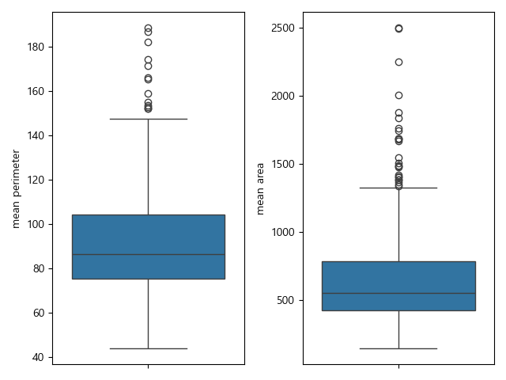
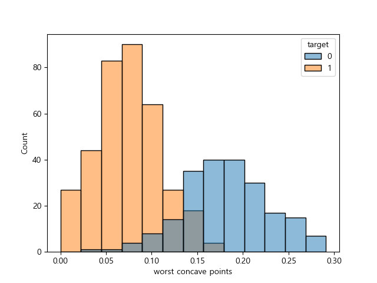
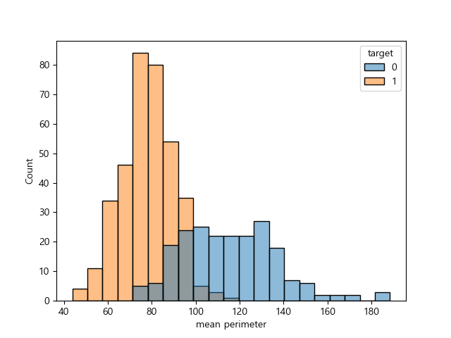
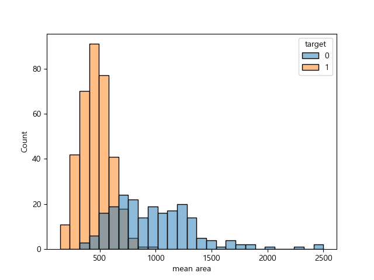

# Day 35 (2025-08-17)
## 개요
- 분류 모델 비교 (로지스틱 회귀, 결정트리, 랜덤포레스트, XGBoost) 레포트 작성
## 목표
- 사이킷런 내장 데이터를 활용하여 암 발생 여부 예측 모델 제작

## EDA
### 'target'(암 발생 여부)에 영향 미치는 변수 확인을 위한 상관계수 분석
- 0 : 암, 1 : 정상
```
>>> df.corr(numeric_only=True)['target'].sort_values(ascending=False)
target                     1.000000
smoothness error           0.067016
mean fractal dimension     0.012838
texture error              0.008303
symmetry error             0.006522
fractal dimension error   -0.077972
concavity error           -0.253730
compactness error         -0.292999
worst fractal dimension   -0.323872
mean symmetry             -0.330499
mean smoothness           -0.358560
concave points error      -0.408042
mean texture              -0.415185
worst symmetry            -0.416294
worst smoothness          -0.421465
worst texture             -0.456903
area error                -0.548236
perimeter error           -0.556141
radius error              -0.567134
worst compactness         -0.590998
mean compactness          -0.596534
worst concavity           -0.659610
mean concavity            -0.696360
mean area                 -0.708984
mean radius               -0.730029
worst area                -0.733825
mean perimeter            -0.742636
worst radius              -0.776454
mean concave points       -0.776614
worst perimeter           -0.782914
worst concave points      -0.793566
Name: target, dtype: float64
```
### 이상치 탐색
- 높은 상관 관계를 가진 변수들의 이상치 탐색

-> 이상치가 상당수 존재함. drop / 보존?

--> 시각화 해보자!!


### 높은 상관 관계를 가진 변수의 시각화
1. target별 worst concave points 분포


2. target별 mean perimeter 분포


3. target별 mean area 분포


-> 암 환자들이 mean perimeter, worst concave points, mena area가 높다!

**즉, 의미가 있는 이상치이므로 보존하는 식으로 진행**


## 모델링
- 랜덤포레스트, 결정트리, XGBoost 3개의 모델 제작

| 모델              | 재현율 (Recall) | 정밀도 (Precision) | 정확도 (Accuracy) | F1 Score | AUC  |
|-------------------|-----------------|--------------------|-------------------|----------|------|
| 결정트리 (Decision Tree) |       0.94          |   0.96                 |       0.94            |  0.95        | 0.93     |
| 랜덤포레스트 (Random Forest) |       0.97          |    0.96                |       0.96            | 0.97         | 0.99     |
| XGBoost           |      0.99           |      0.95              |    0.96               |   0.97       | 0.99     |

-> 이 프로젝트는 암 환자를 예측하는 모델을 제작한 것임. 즉, 실제 암 환자들 중 모델이 암이라고 예측해야 하는 비율이 많아야 하므로, 재현율이 높은 XGBoost를 선택할 수 있다.