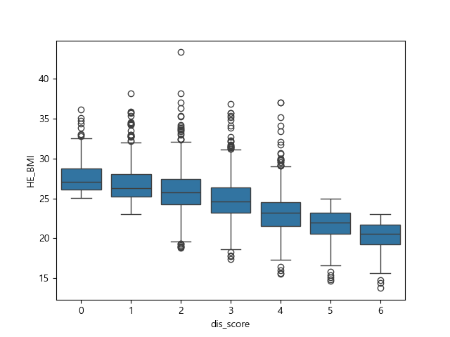
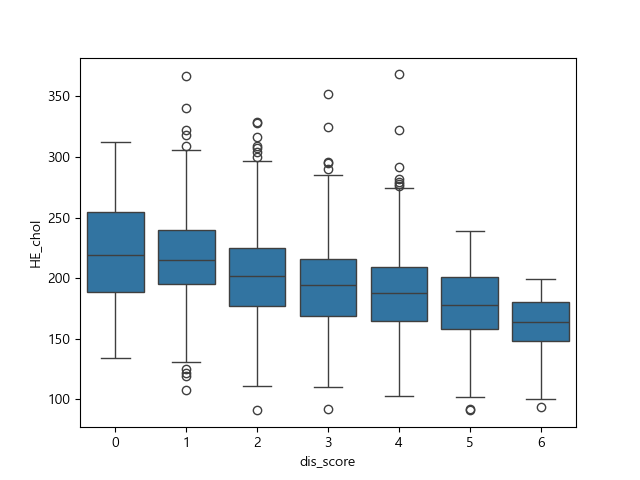
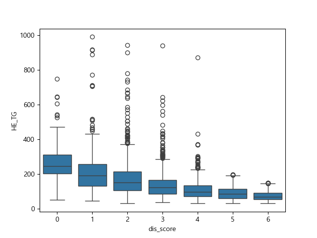
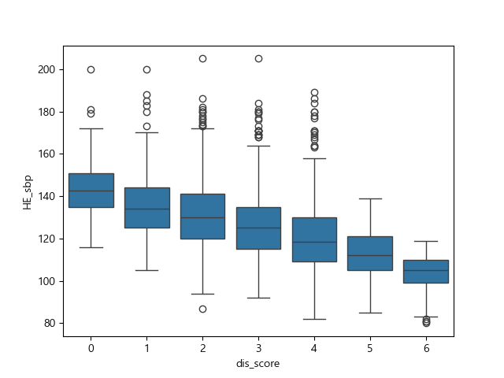
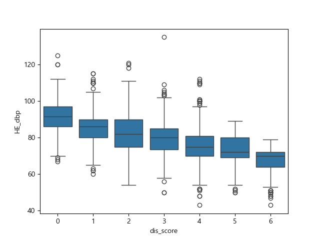

# 일상 생활 지표를 기반으로 한 대사성 증후군 예측 모델 제작 프로젝트
# 0. 데이터 셋 ([Raw Data](../~$sas1.xlsx))
**[코드북](../feature_explain.md)** 참고
- 특성
1. ID : 사람 별 ID
2. region : 대한민국의 17개 시/도 구분 
3. sex : 성별 (1 : 남 / 2 : 여)
4. age : 나이
5. incm : 소득
6. edu : 학력
7. BD1 : 평생 음주 여부
8. BS1_1 : 평생 흡연 여부
9. sm_presnt : 현재 흡연 여부
10. HE_sbp : 수축기 혈압
11. HE_dbp : 이완기 혈압
12. HE_ht : 키
13. HE_wt : 몸무게
14. HE_BMI : BMI
15. HE_chol : 총 콜레스테롤 수치
16. HE_TG : 중성지방 수치
17. exer : 규칙적인 운동 여부

- **총 17개 특성, 4862명 데이터**

# **1. Data PreProcessing**
- [전처리 파일](../codefile/data_preprocess.py) 참고
## **feature 정리**
### 나이
- 구간\
19-29 : 청년층\
30-49세 : 중년층\
50~64세 : 장년기\
65세 이상 : 노년층
- 최종 특성(age_group)\
1 : 청년층\
2 : 중년층\
3 : 노년층

### 생활 습관
- 평생 음주 여부(BD1), 운동(exer), 성별(sex)는 raw data의 값 그대로 사용
1. **소득 수준(incm_new)**\
1 : 하\
2 : 중\
3 : 상

2. **학력 수준(edu_new)**\
1 : 중졸 이하\
2 : 고졸\
3 : 대졸

3. **흡연 여부(smoking)**
- BS1_1 : 3이면, 비흡연자
- BS_1 : 1 또는 2이고, sm_presnt가 0이면, 금연자
- 그 외 : 흡연자\
0 : 비흡연자\
1 : 금연자\
2 : 흡연자

### 대사 질환
1. **비만 여부(obese)**\
0 : 비만\
1 : 과체중\
2 : 정상

2. **혈압(bp)**\
0 : 고혈압\
1 : 고혈압 전단계\
2 : 정상

3. **이상지질혈증(dys)**\
0 : 이상지질혈증\
1 : dys 위험군\
2 : 정상

4. **최종 대사 증후군 위험 정도 점수화(dis_score)**
- obese, bp, dys 칼럼의 점수를 모두 합산 후, 0~6으로 수치화
- 점수가 0 -> 6으로 갈수록 대사 증후군을 앓고 있지 않음

5. **모델에 사용하지 않을 변수 drop**
- 새롭게 만들어 낸 변수와 겹치는 변수들\
age, incm, edu, BS1_1, sm_presnt
- 사람들 간의 차이를 보는 모델 제작이 목표이므로 region도 drop

### [df_new](../data/df_new.csv) 데이터 셋 생성 

## 이상치 제거
- 의학적 기준을 따름
```
1. BMI <10 or BMI > 60 이면 이상치
2. sbp < 70 or sbp > 250 / dbp < 40 or dbp > 150 이면 이상치
3. chol < 70 or chol > 400이면 이상치
4. TG < 30 or TG > 1000이면 이상치
```

### [df_clean](../data/df_clean.csv) 데이터 셋 생성
- **최종적으로 4818명 데이터 생성 완료**

---
# **2. EDA**
- [EDA 코드 파일](../codefile/EDA.py) 참고
## dis_score에 따른 건강 지표들의 분포 시각화
**1. BMI**


**2. 총 콜레스테롤 수치**


**3. 중성 지방 수치**


**4. 수축기 혈압**


**5. 이완기 혈압**


- 전체적으로 더 건강한 그룹일수록, 모든 건강 지표에 대해서 그 정도가 낮아지는 경향을 보임

## dis_score별 범주형 변수들의 카이제곱 검정 결과(P 값)
| 성별     | 평생음주여부 | 소득수준  | 학력수준   | 흡연여부   | 운동여부  | 나이분포   |
|----------|--------------|-----------|------------|------------|-----------|------------|
| p<0.0001 | p<0.0001     | p=0.38    | p<0.0001   | p<0.0001   | p=0.44    | p<0.0001   |

- 소득 수준, 운동 여부는 제외하고 총 5개의 특성으로 모델 제작!!

---
# **3. Modelling**
- [모델링 코드 파일](../codefile/modelling.py) 참고
## 모델의 예측에 사용할 target 변수 제작
- 이유 : 4818명의 데이터만으로 6개의 칼럼을 다중 분류 하는 것은 무리라고 판단

- dis_score가 0,1,2이면 '위험군', 3,4이면 '주의', 5,6이면 '저위험군'

- target\
0 : 위험군\
1 : 주의군\
2 : 정상

## 사용한 모델
1. 로지스틱 회귀
2. 랜덤 포레스트
3. XGBoost

## 결과
### 로지스틱 회귀
| class        | precision | recall | f1-score | support |
|--------------|-----------|--------|----------|---------|
| 0            | 0.40      | 0.55   | 0.46     | 395     |
| 1            | 0.42      | 0.25   | 0.31     | 509     |
| 2            | 0.57      | 0.65   | 0.61     | 542     |
| **accuracy** |           |        | 0.48     | 1446    |
| macro avg    | 0.47      | 0.48   | 0.46     | 1446    |
| weighted avg | 0.47      | 0.48   | 0.46     | 1446    |

### 랜덤포레스트
| class        | precision | recall | f1-score | support |
|--------------|-----------|--------|----------|---------|
| 0            | 0.37      | 0.38   | 0.38     | 395     |
| 1            | 0.40      | 0.40   | 0.40     | 509     |
| 2            | 0.63      | 0.62   | 0.63     | 542     |
| **accuracy** |           |        | 0.48     | 1446    |
| macro avg    | 0.47      | 0.47   | 0.47     | 1446    |
| weighted avg | 0.48      | 0.48   | 0.48     | 1446    |

### XGBoost
| class        | precision | recall | f1-score | support |
|--------------|-----------|--------|----------|---------|
| 0            | 0.38      | 0.41   | 0.39     | 395     |
| 1            | 0.39      | 0.37   | 0.38     | 509     |
| 2            | 0.63      | 0.62   | 0.63     | 542     |
| **accuracy** |           |        | 0.48     | 1446    |
| macro avg    | 0.47      | 0.47   | 0.47     | 1446    |
| weighted avg | 0.48      | 0.48   | 0.48     | 1446    |

## 결과 분석
**1. 정확도**
- 대부분의 모델이 약 0.48 정도의 정확도를 보여준다. 이는 class가 3개라는 점에서 무작위로 찍었을 때(0.33)보다 약간 더 높은 정확도를 보여준다.

**2. class별 해석**
- 대부분의 모델이 class 2(저위험군)에 대해서는 나름 괜찮은 정밀도 및 재현율(약 0.6)을 보여주지만 실제로 예측이 중요한 class 0 또는 1(위험군)에 대해서는 매우 낮은 성능을 보여줬다.

---
# **4. 한계점**
**1. 특성 수 부족**
- 제작한 모든 모델에 대해 비슷한 정확도가 제시된 것을 보았을 때, 궁극적인 특성 수가 부족했다고 해석할 수 있다.
- 분류해야 하는 class는 총 3개 이고, 이를 5개의 특성(성별, 평생 음주 여부, 학력, 흡연, 나이)만으로 정확하게 분류하는 것은 거의 불가능에 가깝다.
- 더욱 극단적으로 생각했을 때, 실제 성인 중 '평생 음주'를 하지 않은 이는 거의 없을거라고 생각하고, 실제 사람이 조절 가능한 생활 습관은 해당 특성들에서 '흡연'뿐인 점을 생각하면 특성 수가 매우 부족했다.

**2. 클래스 불균형**
- 실제 대사 증후군의 정의는, 단일 질환이 아닌 비만, 고혈압, 고혈당, 이상지질혈증, 인슐린 저항성 등 여러 대사적 요인이 총 3개 이상 나타나는 상태이다.
- 해당 데이터에서 도출할 수 있는 대사 질환은 총 3개이고, 이들 모두가 발현한 상태를 '대사 증후군' 타겟으로 분류한다면 해당 데이터에서는 심각한 클래스 불균형이 이루어진다.
- 때문에, 실제 '대사 증후군' 타겟을 생성하지 못하고, 단순히 고위험/주의/정상 그룹으로 분류했다는 점에서 데이터의 신뢰도가 낮아진다는 문제가 발생했다.

# **5. 인사이트 도출**
**1. 생활 습관과 대사 증후군의 실제 관계**
- 생활 습관이 대사 증후군에 영향 미치는 사실은 의심의 여지가 없다. dis_score와 다양한 생활 습관(흡연, 음주여부, 성별 등)이 유의미한 상관 관계를 보였기 때문이다.(p<0.0001)
- 하지만, 해당 특성들이 실제로 대사 증후군에 미치는 영향을 정량화 하지는 못하였다. 모델의 성능이 낮게 나왔다는 점에 미루어보아, 앞서 언급한 특성이 실제 대사 증후군에 미치는 영향은 미미하고 대사 증후군에 영향 미치는 다른 요인들이 존재함을 알 수 있다.
- 이 점과 관련해서 추후 R^2 값을 추가로 출력하여 다음 프로젝트부터는 반영할 계획이다.

**2. 대사 질환 간의 관계**
- dis_score와 건강 지표들을 시각화 한 부분에서 위험군에 가까울 수록 다양한 건강 지표들의 수치가 모두 높음을 알 수 있다. 즉, 대사질환을 가지는 사람들이 또 다른 대사질환을 가질 가능성이 매우 크다는 점을 시사한다.
- 해당 부분과 관련하여 사용한 데이터(sas1.xlsx)에서 얻을 수 있는 대사 질환(비만, 고혈압, 이상지질혈증)간의 interaction이 실제로 유의한지 추후 추가적인 통계 검정을 할 필요성이 있다.

# **6. 추후 개선점**
**1. 특성 수 늘리기**
- 이번 프로트의 절대적인 문제점이라고 볼 수 있다. 고작 5개의 특성 만으로 다중 분류 모델 제작을 시도한 점에서, 추후 원시 자료를 구할 수 있다면 동일한 내용으로 특성 수를 추가해서 모델을 개선해보고 싶다.

**2. 하이퍼파라미터 튜닝**
- 이번 방학에 진행한 프로젝트에서 거의 대부분 모델의 동작만을 학습하였는데 실제로는 모델의 성능을 개선하기 위해 하이퍼파라미터를 튜닝하여야 한다. 하지만 해당 부분과 관련해서는 각 모델별 정확한 매커니즘의 이해가 아직 부족하기에 추후 더 학습 할 필요가 있다.